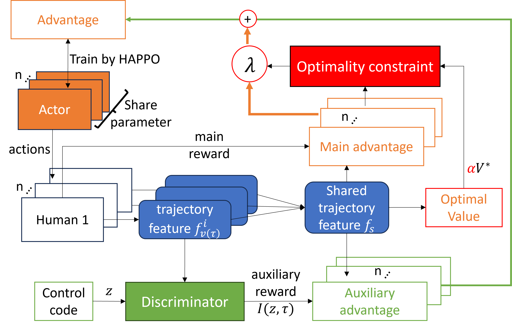

<div align="center">
  
</div>

<h1 align="center"> Diversity-aware Crowd Model for Robust Robot Navigation in Human Populated Environment</h1>

This repository contains the implementation and experiment codes for our paper Diversity-aware Crowd Model for Robust Robot Navigation in Human Populated Environment.
<!-- **official implementation** of **Heterogeneous-Agent Reinforcement Learning (HARL)** algorithms, including **HAPPO**, **HATRPO**, **HAA2C**, **HADDPG**, **HATD3**, **HAD3QN**, and **HASAC**, based on PyTorch. ***HARL algorithms are markedly different from MAPPO in that they are generally applicable to heterogeneous agents and are supported by rigorous theories, often achieving superior performance.*** This repository allows researchers and practitioners to easily reproduce our results on seven challenging benchmarks or apply HARL algorithms to their intended applications. -->


## Introduction

Robot navigation in human-populated environments
poses challenges due to the diversity of human behaviors
and the unpredictability of human paths. However, existing Reinforcement
Learning (RL)-based methods often rely on simulators
that lack sufficient diversity in human behavior, resulting
in navigation policies that overfit specific human behavior and
perform poorly in unseen environments. To address this, we
propose a diversity-aware crowd model based on Reinforcement
Learning, employing Constrained Variational Exploration
(VE) with a Mutual Information (MI)-based auxiliary reward
to capture fine-grained behavioral diversity. The proposed
model leverages a Centralized Training Decentralized Execution
(CTDE) paradigm, which ensures stable exploration under
multi-agent settings. Using the proposed diversity-aware model
for training, we obtain robust robot navigation policies capable
of handling diverse unseen scenarios. Extensive simulation and
real-world experiments demonstrate the superior performance
of our approach in achieving diverse crowd behaviors and
enhancing robot navigation robustness. These findings highlight
the potential of our method to advance safe and efficient robot
operations in complex dynamic environments.

### Key features

<!-- - HARL algorithms achieve coordinated agent updates by employing the *sequential update scheme*, different from the *simultaneous update scheme* utilized by MAPPO and MADDPG.
- HARL algorithms enjoy theoretical guarantees of **monotonic improvement** and **convergence to equilibrium**, ensuring their efficacy in promoting cooperative behavior among agents.
- Both on-policy and off-policy HARL algorithms, exemplified by **HAPPO** and **HASAC** respectively, demonstrate superior performance across a wide range of benchmarks.

The following figure is an illustration of the *sequential update scheme*
<div align="center">
  
</div>
-->
** Constrained Variational Exploration **
** Centralized Training Decentralize Execution **

For more details, please refer to our paper: Diversity-aware Crowd Model for Robust Robot Navigation in Human Populated Environment.


## Installation

### Install the package

```shell
conda create -n harl python=3.8
conda activate harl
# Install pytorch>=1.9.0 (CUDA>=11.0) manually
git clone https://github.com/PKU-MARL/HARL.git
cd robust_robot_navi
pip install -e .
```


### Install Environments Dependencies
[HARL](https://github.com/PKU-MARL/HARL)
[Gym](https://www.gymlibrary.dev/).


### Solve Dependencies

After the installation above, run the following commands to solve dependencies.

```shell
pip install gym==0.21.0
pip install pyglet==1.5.0
pip install importlib-metadata==4.13.0
```


## Usage

### Training on Existing Environments
Create you preferred config 
```shell
python script/create_config.py
```
After modify the train_all.sh or train_select.sh to add path of you config,
Run
```shell
bash script/train_select.sh
```

## Citation

Our implementation is based on:
[Peking University](https://www.pku.edu.cn//) and [BIGAI](https://www.bigai.ai/). If you find our paper or this repository helpful in your research or project, please consider citing our works using the following BibTeX citation:

```tex
@article{JMLR:v25:23-0488,
  author  = {Yifan Zhong and Jakub Grudzien Kuba and Xidong Feng and Siyi Hu and Jiaming Ji and Yaodong Yang},
  title   = {Heterogeneous-Agent Reinforcement Learning},
  journal = {Journal of Machine Learning Research},
  year    = {2024},
  volume  = {25},
  number  = {32},
  pages   = {1--67},
  url     = {http://jmlr.org/papers/v25/23-0488.html}
}
```

```tex
@inproceedings{
liu2024maximum,
title={Maximum Entropy Heterogeneous-Agent Reinforcement Learning},
author={Jiarong Liu and Yifan Zhong and Siyi Hu and Haobo Fu and QIANG FU and Xiaojun Chang and Yaodong Yang},
booktitle={The Twelfth International Conference on Learning Representations},
year={2024},
url={https://openreview.net/forum?id=tmqOhBC4a5}
}
```
